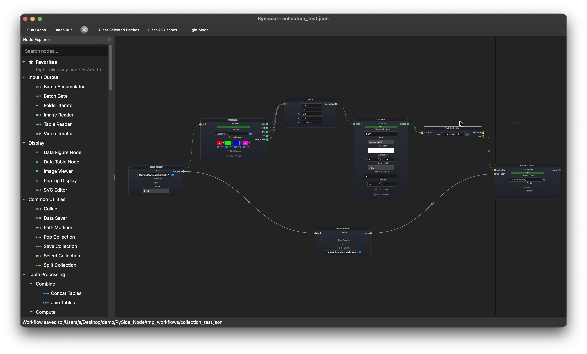

<p align="center">
  
</p>

<h1 align="center">Synapse</h1>

<p align="center">
  <a href="README.md">English</a> | <a href="README.zh-TW.md">繁體中文</a>
</p>

<p align="center">
  A visual node-graph workflow editor for scientific data analysis.
</p>

<p align="center">
  <a href="https://creativecommons.org/licenses/by-nc/4.0/"></a>
  
  
</p>

---

Connect processing steps on a canvas to build full analysis pipelines, from loading raw data to generating figures. No code, no app-switching, no reformatting files between steps.

## What it does

- **Visual pipeline builder**: connect nodes on a canvas to build analysis workflows
- **Reproducible & shareable**: workflows save as `.json` files that anyone can open and run
- **Batch processing**: iterate over entire folders with automatic result accumulation
- **Plugin system**: extend with custom nodes distributed as `.py`, `.zip`, or `.synpkg` packages
- **AI workflow assistant** *(beta)*: describe what you want and the AI builds the node graph (Ollama, OpenAI, Claude, Gemini, Groq)
- **Cross-platform**: macOS, Windows, and Linux

## Download

Standalone builds (no Python needed):

| Platform | Download |
|----------|----------|
| macOS (Apple Silicon) | [Synapse-macOS-arm64.dmg](https://github.com/m00zu/Synapse/releases/latest/download/Synapse-macOS-arm64.dmg) |
| Windows (64-bit) | [Synapse.exe](https://github.com/m00zu/Synapse/releases/latest/download/Synapse.exe) |

See all releases on the [Releases page](https://github.com/m00zu/Synapse/releases).

## Installation (from source)

Tested on Python 3.13 and 3.14.

```bash
git clone https://github.com/m00zu/Synapse
cd Synapse
pip install .
```

Optional but recommended: Install pre-built Rust extensions for faster OIR file reading and image processing:

```bash
pip install oir_reader_rs image_process_rs --find-links https://github.com/m00zu/Synapse/releases/expanded_assets/rust-v0.1.1
```

Then run:

```bash
synapse
```

## Example workflows

### CSV analysis

`Table Reader` > `Filter Table` > `Single Table Math` > `Aggregate Table` > `Data Table Node`

Load a CSV of cell measurements, filter out debris (`area > 100`), compute circularity (`4 * pi * area / perimeter^2`), aggregate by group to get mean values for Control vs Treatment, and display the summary.

<p align="center">
  
</p>

### Object detection and measurement

`Image Reader` > `Gaussian Blur` > `Binary Threshold` > `Fill Holes` > `Watershed` > `Data Table Node`

Load a coin image, blur to reduce noise, threshold, fill holes, then watershed to separate touching objects. Outputs area, perimeter, and circularity for each detected object.

<p align="center">
  
</p>

### Statistical comparison

`Table Reader` > `Filter Table` > `Pairwise Comparison` > `Bar Plot` > `Data Figure Node`

Load cell measurement data, filter out debris, run a pairwise comparison on `intensity_mean` between Control and Treatment, and plot the result with significance annotations.

<p align="center">
  
</p>

### Batch OIR conversion

```
Folder Iterator --> Image Reader  --> Data Saver
       └---------> Path Modifier -----↗
```

Batch-convert Olympus OIR microscopy files to TIFF. The iterator feeds each `.oir` path to both the reader (decodes the image) and the path modifier (swaps the extension to `.tif` and redirects to an output folder). Both connect to the saver.

<p align="center">
  
</p>

### Batch multi-channel export with collections

```
Folder Iterator --> OIR Reader --> Collect --> Scale Bar --> Split Collection --> Save Collection
       └---------> Path Modifier -----------------------------------------------↗
```

Batch-process a folder of multi-channel OIR files. The OIR Reader splits each file into individual channels (ch1–ch4) plus a composite. The Collect node bundles all outputs into a single collection. Scale Bar applies the same scale bar to every channel automatically. Split Collection separates the composite and ch1 from others and saves them to an output folder with extension both determined by Path Modifier.

<p align="center">
  
</p>

### Collagen area measurement (video)

https://github.com/user-attachments/assets/a3772ee9-da64-4fe1-ad58-ee22ac6f41aa

<p align="center"><i>Color deconvolution of a Masson's trichrome stain, threshold the collagen channel, measure area.</i></p>

## Plugins

The core handles data I/O, table operations, and display. Domain-specific nodes ship as plugins with their dependencies bundled in.

### Installing plugins

**From the in-app Plugin Manager (recommended):**

1. In Synapse, go to **Plugins > Plugin Manager** and open the **Browse Online** tab
2. Browse available plugins, then click **Install** on the ones you need
3. The plugin is downloaded and installed automatically — new nodes appear in the Node Explorer after restart

**Manual install:**

1. Download `.synpkg` files from [Synapse-Plugins Releases](https://github.com/m00zu/Synapse-Plugins/releases)
2. In Synapse, go to **Plugins > Install Plugin** and select the `.synpkg` file
3. Click **Plugins > Reload Plugins** and the new nodes appear in the Node Explorer

You can also drop `.py` files or extracted plugin folders directly into the `plugins/` directory.

### Available plugins

| Plugin | Description |
|--------|-------------|
| Image Analysis | Filters, thresholding, morphology, segmentation, measurements, ROI |
| Statistical Analysis | t-tests, ANOVA, regression, survival analysis, PCA |
| Figure Plotting | Scatter, box, violin, heatmap, volcano, regression plots |
| SAM2 & Cellpose | SAM2, Cellpose, video tracking |
| Cheminformatics | RDKit molecule editing, docking, protein prep |
| 3D Volume | Volume rendering and analysis |
| Filopodia | Cell protrusion detection and measurement (Port of FiloQuant) |

## Documentation

Available at [m00zu.github.io/Synapse](https://m00zu.github.io/Synapse/) and built into the app via **Help > Open Manual**.

## License

This work is licensed under [CC BY-NC 4.0](https://creativecommons.org/licenses/by-nc/4.0/). You can use, share, and adapt it for non-commercial purposes with attribution.
