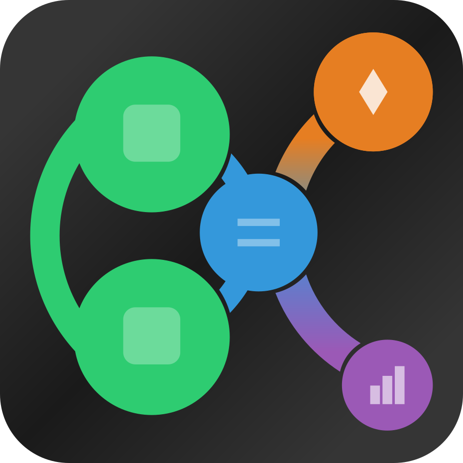
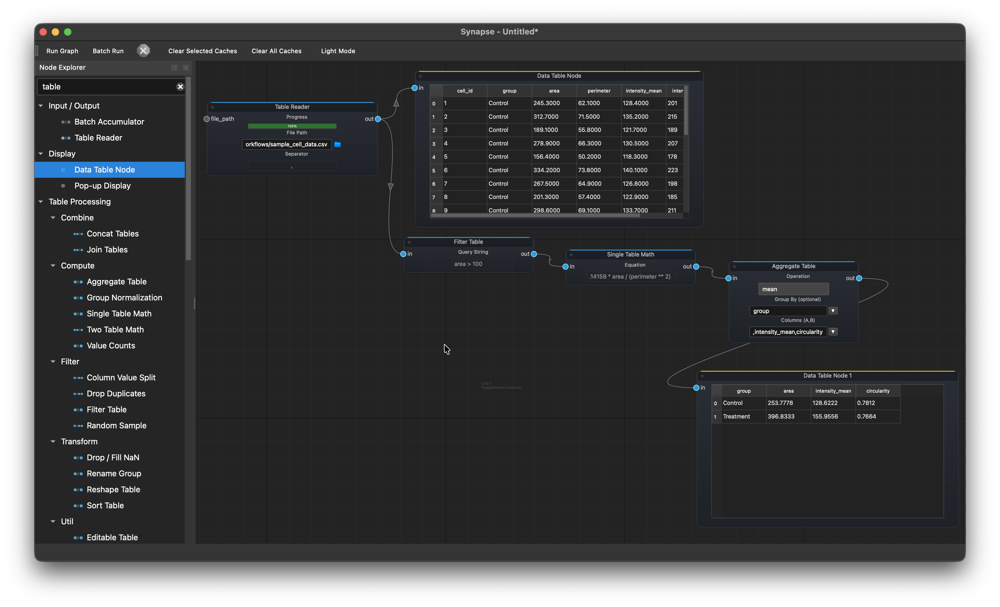
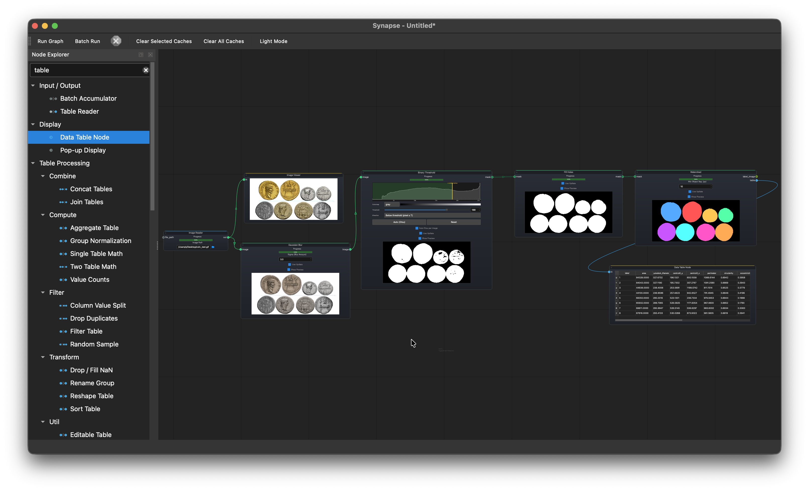
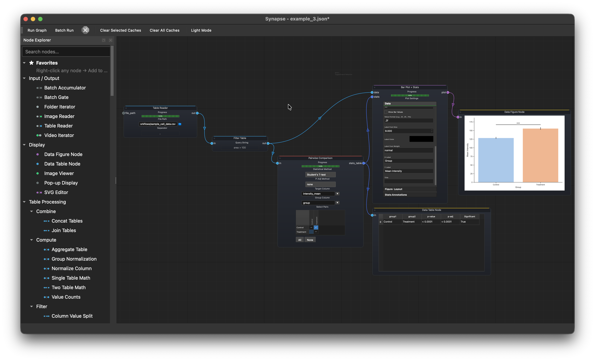
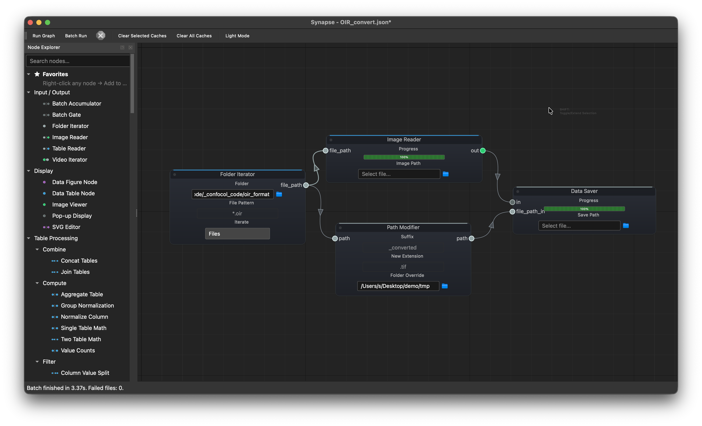
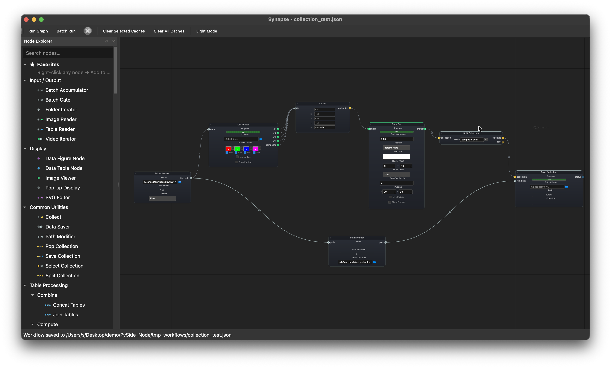

<p align="center">
  
</p>

<h1 align="center">Synapse</h1>

<p align="center">
  <a href="README.md">English</a> | <a href="README.zh-TW.md">繁體中文</a>
</p>

<p align="center">
  A visual node-graph workflow editor for scientific data analysis.
</p>

<p align="center">
  <a href="https://polyformproject.org/licenses/noncommercial/1.0.0"></a>
  
  
</p>

---

Connect processing steps on a canvas to build full analysis pipelines, from loading raw data to generating figures. No code, no app-switching, no reformatting files between steps.

## What it does

- **Visual pipeline builder**: connect nodes on a canvas to build analysis workflows
- **Reproducible & shareable**: workflows save as `.json` files that anyone can open and re-run deterministically
- **Strict port type checking**: connections enforce data-type compatibility (a `MaskData` output can feed an `ImageData` input via subclass upcast, but never the other way around); errors surface at connection time in the status bar
- **Auto-organize layout**: `Ctrl+L` re-positions every node left-to-right with overlap-safe stacking
- **Run Selected (Up To)**: `Ctrl+Shift+W` runs the selected nodes and their upstream dependencies, skipping anything downstream — useful for debugging without firing save/report nodes
- **Batch processing**: iterate over entire folders with automatic result accumulation
- **Plugin system**: extend with custom nodes distributed as `.py`, `.zip`, or `.synpkg` packages
- **Two AI surfaces**:
  - **In-app AI Chat panel** — 8 providers including local **Ollama** and **llama.cpp** (no API key, no internet); pay-as-you-go for cloud models
  - **MCP server** — drive Synapse from external chat clients (**Claude Code**, **Claude Desktop**, **Antigravity**, **Gemini CLI**) using your existing chat subscription; one-click setup per client
- **Cross-platform**: macOS, Windows, and Linux

## Download

Standalone builds (no Python needed):

| Platform | Download |
|----------|----------|
| macOS (Apple Silicon) | [Synapse-macOS-arm64.dmg](https://github.com/m00zu/Synapse/releases/latest/download/Synapse-macOS-arm64.dmg) |
| Windows (64-bit) | [Synapse.exe](https://github.com/m00zu/Synapse/releases/latest/download/Synapse.exe) |

See all releases on the [Releases page](https://github.com/m00zu/Synapse/releases).

> **First launch on macOS**: macOS may block the app because it is not signed. Right-click the app → **Open** → click **Open** in the dialog. Or run in Terminal:
> ```bash
> xattr -cr /Applications/Synapse.app
> ```
> This only needs to be done once.

> **First launch on Windows**: Windows SmartScreen may show a warning. Click **More info** → **Run anyway**. This only needs to be done once.

## Installation (from source)

Tested on Python 3.13 and 3.14.

```bash
git clone https://github.com/m00zu/Synapse
cd Synapse
pip install .
```

Optional but recommended: Install pre-built Rust extensions for faster OIR file reading and image processing:

```bash
pip install oir_reader_rs image_process_rs --find-links https://github.com/m00zu/Synapse/releases/expanded_assets/rust-v0.1.1
```

Then run:

```bash
synapse
```

## Example workflows

### CSV analysis

`Table Reader` > `Filter Table` > `Single Table Math` > `Aggregate Table` > `Data Table Node`

Load a CSV of cell measurements, filter out debris (`area > 100`), compute circularity (`4 * pi * area / perimeter^2`), aggregate by group to get mean values for Control vs Treatment, and display the summary.

<p align="center">
  
</p>

### Object detection and measurement

`Image Reader` > `Gaussian Blur` > `Binary Threshold` > `Fill Holes` > `Watershed` > `Data Table Node`

Load a coin image, blur to reduce noise, threshold, fill holes, then watershed to separate touching objects. Outputs area, perimeter, and circularity for each detected object.

<p align="center">
  
</p>

### Statistical comparison

`Table Reader` > `Filter Table` > `Pairwise Comparison` > `Bar Plot` > `Data Figure Node`

Load cell measurement data, filter out debris, run a pairwise comparison on `intensity_mean` between Control and Treatment, and plot the result with significance annotations.

<p align="center">
  
</p>

### Batch OIR conversion

```
Folder Iterator --> Image Reader  --> Data Saver
       └---------> Path Modifier -----↗
```

Batch-convert Olympus OIR microscopy files to TIFF. The iterator feeds each `.oir` path to both the reader (decodes the image) and the path modifier (swaps the extension to `.tif` and redirects to an output folder). Both connect to the saver.

<p align="center">
  
</p>

### Batch multi-channel export with collections

```
Folder Iterator --> OIR Reader --> Collect --> Scale Bar --> Split Collection --> Save Collection
       └---------> Path Modifier -----------------------------------------------↗
```

Batch-process a folder of multi-channel OIR files. The OIR Reader splits each file into individual channels (ch1–ch4) plus a composite. The Collect node bundles all outputs into a single collection. Scale Bar applies the same scale bar to every channel automatically. Split Collection separates the composite and ch1 from others and saves them to an output folder with extension both determined by Path Modifier.

<p align="center">
  
</p>

### Collagen area measurement (video)

https://github.com/user-attachments/assets/a3772ee9-da64-4fe1-ad58-ee22ac6f41aa

<p align="center"><i>Color deconvolution of a Masson's trichrome stain, threshold the collagen channel, measure area.</i></p>

## Using AI

Synapse has **two AI surfaces** — both drive the same node graph. Pick whichever fits your cost model and workflow.

### In-app AI Chat (works offline with Ollama)

1. **View > AI Chat** to open the dock panel.
2. Pick a provider. For zero setup with no API key, install [Ollama](https://ollama.com) and pull a model (`ollama pull gemma3:12b`).
3. Type a description — the assistant builds and edits the canvas for you.

Supports Claude, OpenAI, Gemini, Groq, OpenRouter, Ollama, llama.cpp, and RunPod. API keys are stored locally via the OS keyring; conversation history is session-only.

### MCP from your existing chat client

Synapse runs an MCP server on `127.0.0.1:51780` so external chat clients can read, modify, and run your graph using your existing chat subscription (no per-token billing on Synapse's side).

1. **Help > AI Connection (MCP)...** opens the connection dialog.
2. Click the setup button for your chat client (**Claude Code**, **Claude Desktop**, **Antigravity**, or **Gemini CLI**) — the right config is written automatically.
3. Open your chat client and ask it to inspect, build, or modify a workflow.

See the [AI overview](https://m00zu.github.io/Synapse/ai/) for the full feature reference.

## Plugins

The core handles data I/O and display. Domain-specific nodes ship as plugins with their dependencies bundled in.

### Installing plugins

**From the in-app Plugin Manager (recommended):**

1. In Synapse, go to **Plugins > Plugin Manager** and open the **Browse Online** tab
2. Browse available plugins, then click **Install** on the ones you need
3. The plugin is downloaded and installed automatically, click **Plugins > Reload Plugins** to load the new nodes

**Manual install:**

1. Download `.synpkg` files from [Synapse-Plugins Releases](https://github.com/m00zu/Synapse-Plugins/releases)
2. In Synapse, go to **Plugins > Install Plugin** and select the `.synpkg` file
3. Click **Plugins > Reload Plugins** and the new nodes appear in the Node Explorer

You can also drop `.py` files or extracted plugin folders directly into the `plugins/` directory.

### Available plugins

| Plugin | Description |
|--------|-------------|
| Data Processing | Table filter, sort, math column, aggregate, concat, join (installed by default) |
| Image Analysis | Filters, thresholding, morphology, segmentation, measurements, ROI |
| Statistical Analysis | t-tests, ANOVA, regression, survival analysis, PCA |
| Figure Plotting | Scatter, box, violin, heatmap, volcano, regression, SVG editor |
| Machine Learning | scikit-learn classifiers, regressors, clustering, embedding (UMAP), SHAP, train/test split |
| SAM2 & Cellpose | SAM2 click-to-segment, Cellpose batch + single-image, video tracking |
| Cheminformatics | RDKit molecule editing, fingerprints, scaffolds, batch docking (AutoDock Vina / GNINA), protein prep |
| 3D Volume | Z-stack I/O, 3D morphology, volume rendering |
| Filopodia | Cell protrusion detection and measurement (port of FiloQuant) |
| Report | Markdown / HTML report generation from workflow outputs |

## Documentation

Available at [m00zu.github.io/Synapse](https://m00zu.github.io/Synapse/) and built into the app via **Help > Open Manual**.

## License

Licensed under the [PolyForm Noncommercial License 1.0.0](https://polyformproject.org/licenses/noncommercial/1.0.0). You may use, modify, and distribute Synapse for any noncommercial purpose, including personal projects, academic research, and use within nonprofit or government organizations. Commercial use requires a separate license from the copyright holder.
