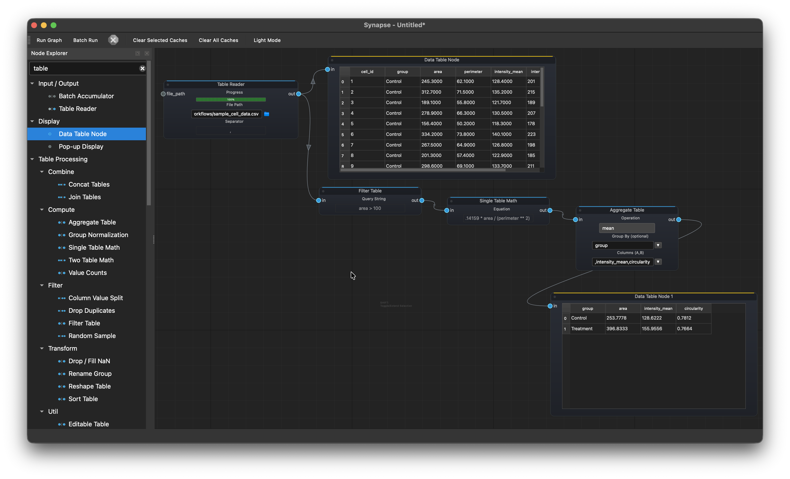
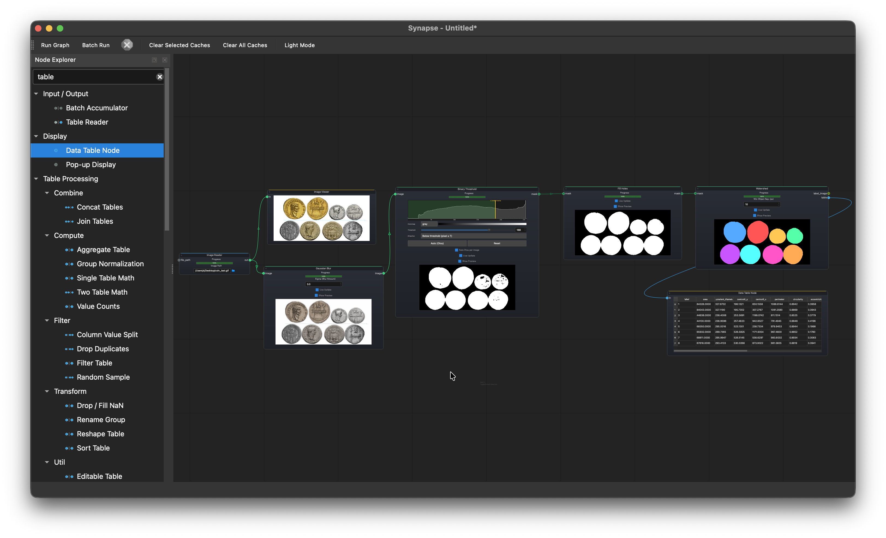
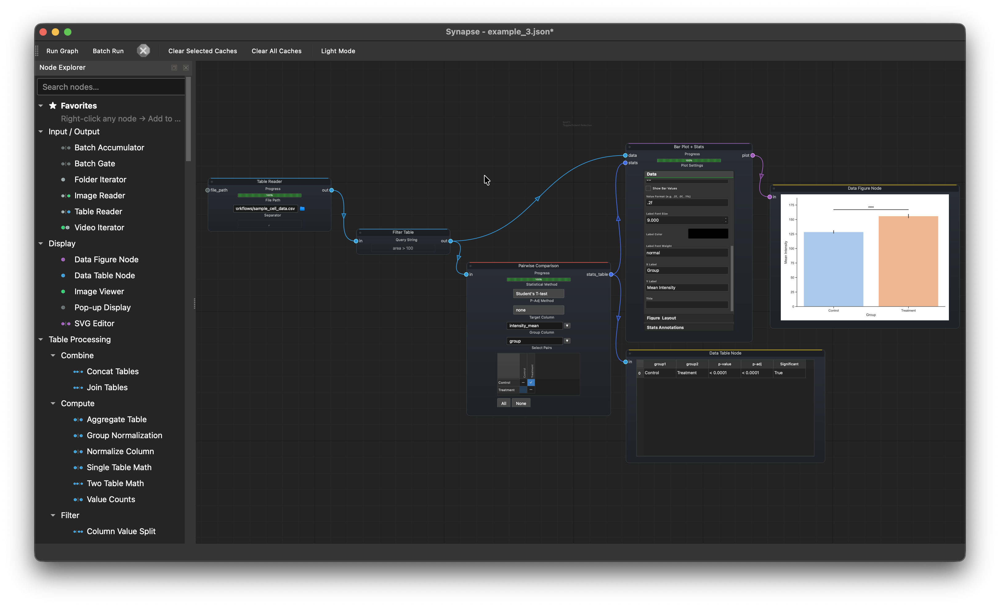
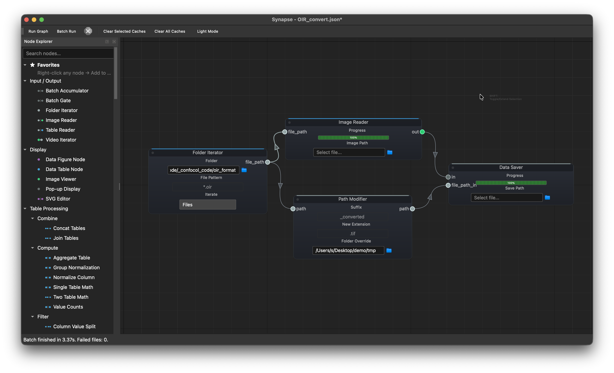

<p align="center">
  
</p>

<h1 align="center">Synapse</h1>

<p align="center">
  <a href="README.md">English</a> | <a href="README.zh-TW.md">繁體中文</a>
</p>

<p align="center">
  用於科學數據分析的工作流程編輯器
</p>

<p align="center">
  <a href="https://creativecommons.org/licenses/by-nc/4.0/"></a>
  
  
</p>

---

在畫布上連接各個分析節點來建立完整的分析流程。不用寫程式、不用切換軟體、不用在步驟之間轉換檔案格式。

## 功能

- **視覺化流程建構**：在畫布上連接節點，建立分析工作流程
- **可重現、可分享**：工作流程儲存為 `.json` 檔案，任何人都能開啟並執行
- **批次處理**：處理整個資料夾內的檔案並自動累積結果
- **外掛系統**：透過 `.py`、`.zip` 或 `.synpkg` 套件擴充客製化節點
- **AI 工作流程助理** *(beta)*：用白話文描述你想做的事後讓 AI 自動建構節點圖 (支援 Ollama、OpenAI、Claude、Gemini、Groq)
- **跨平台**：macOS、Windows、Linux

## 下載

獨立執行檔 (不需要安裝 Python)：

| 作業系統 | 下載 |
|------|------|
| macOS (Apple Silicon) | [Synapse-macOS-arm64.dmg](https://github.com/m00zu/Synapse/releases/latest/download/Synapse-macOS-arm64.dmg) |
| Windows (64-bit) | [Synapse.exe](https://github.com/m00zu/Synapse/releases/latest/download/Synapse.exe) |

所有版本請參見 [Releases 頁面](https://github.com/m00zu/Synapse/releases)。

## 從原始碼安裝

測試環境：Python 3.13 與 3.14。

```bash
git clone https://github.com/m00zu/Synapse
cd Synapse
pip install .
```

建議安裝：預編譯的 Rust 擴充套件，可加速 OIR 檔案讀取與部分影像處理：

```bash
pip install oir_reader_rs image_process_rs --find-links https://github.com/m00zu/Synapse/releases/expanded_assets/rust-v0.1.1
```

執行：

```bash
synapse
```

## 範例工作流程

### CSV 分析

`Table Reader` > `Filter Table` > `Single Table Math` > `Aggregate Table` > `Data Table Node`

載入細胞測量的 CSV 檔案，過濾小物件 (`area > 100`)，計算圓度 (`4 * pi * area / perimeter^2`)，最後按分組計算 Control 與 Treatment 的平均值並顯示摘要。

<p align="center">
  
</p>

### 物件偵測與測量

`Image Reader` > `Gaussian Blur` > `Binary Threshold` > `Fill Holes` > `Watershed` > `Data Table Node`

載入硬幣影像，模糊處理以降低雜訊，二值化 (binarize)，填充孔洞，再用分水嶺演算法 (watershed) 分離相鄰物件，最終輸出每個偵測物件的面積、周長與圓度。

<p align="center">
  
</p>

### 統計比較

`Table Reader` > `Filter Table` > `Pairwise Comparison` > `Bar Plot` > `Data Figure Node`

載入細胞測量數據，過濾碎屑，對 Control 與 Treatment 的 `intensity_mean` 進行比較，最終繪製帶顯著性標註的結果圖。

<p align="center">
  
</p>

### 批次 OIR 轉檔

```
Folder Iterator --> Image Reader  --> Data Saver
       └---------> Path Modifier -----↗
```

批次將 Olympus OIR 顯微鏡檔案轉換為 TIFF。Iterator 將每個 `.oir` 路徑同時傳給讀取器（解碼影像）和路徑修改器（將副檔名改為 `.tif` 並導向輸出資料夾），兩者都連接到儲存器。

<p align="center">
  
</p>

### 膠原蛋白面積測量 (影片)

https://github.com/user-attachments/assets/a3772ee9-da64-4fe1-ad58-ee22ac6f41aa

<p align="center"><i>馬森三色染色 (Masson's trichrome stain) 的顏色反捲積 (color deconvolution)，接著對膠原蛋白 channel 進行二值化並測量面積。</i></p>

## 外掛

核心功能只包含進行資料 I/O、表格操作與顯示結果，而特定領域的節點以外掛形式發布。

### 安裝外掛

**從應用程式內的外掛管理器安裝（建議）：**

1. 在 Synapse 中，前往 **Plugins > Plugin Manager** 並開啟 **Browse Online** 分頁
2. 瀏覽可用的外掛，點選 **Install** 即可安裝
3. 外掛會自動下載並安裝 — 重新啟動後新節點會出現在 Node Explorer 中

**手動安裝：**

1. 從 [Synapse-Plugins Releases](https://github.com/m00zu/Synapse-Plugins/releases) 下載 `.synpkg` 檔案
2. 在 Synapse 中，前往 **Plugins > Install Plugin** 並選擇 `.synpkg` 檔案
3. 點選 **Plugins > Reload Plugins**，新節點會出現在 Node Explorer 中

也可以直接將 `.py` 檔案或解壓縮的外掛資料夾放入 `plugins/` 目錄。

### 可用外掛

| 外掛 | 說明 |
|------|------|
| Image Analysis | 濾波、二值化、形態學、分割、測量、ROI |
| Statistical Analysis | t 檢定、ANOVA、迴歸、存活分析、PCA |
| Figure Plotting | 散佈圖、箱型圖、小提琴圖、熱圖、火山圖、迴歸圖 |
| SAM2 & Cellpose | 點擊分割 (SAM2)、細胞/細胞核分割 (Cellpose)、影片追蹤 — 皆為 ONNX，不需要 PyTorch |
| Cheminformatics | RDKit 分子編輯、對接、蛋白質準備 (完整內建) |
| 3D Volume | 體積渲染與分析 |
| Filopodia | 細胞突起偵測與測量 (同 FiloQuant) |

## 使用說明

線上使用說明：[m00zu.github.io/Synapse](https://m00zu.github.io/Synapse/)，也可在應用程式內透過 **Help > Open Manual** 開啟。

## 授權

本程式採用 [CC BY-NC 4.0](https://creativecommons.org/licenses/by-nc/4.0/) 授權。你可以在標示出處的前提下，為非商業目的使用、分享及改作。
